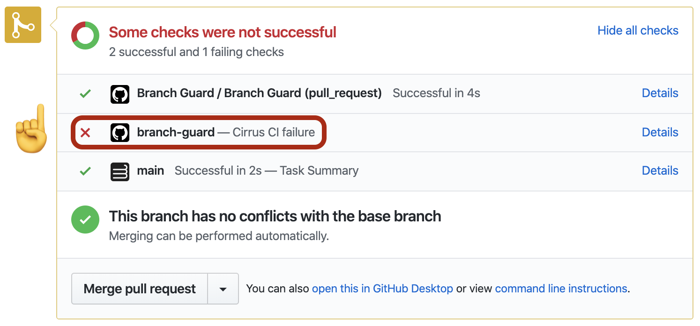

# Deprecated

In favor of a more suphesicated GitHub App. See https://github.com/cirruslabs/gh-submit-queue

# Block PR merges when Checks for target branches are failing 🔓



Create following `.github/workflows/branch-guard.yml` that will block PRs from merging when the latest [Check Suite](https://developer.github.com/v3/checks/)
starts failing and unblock once it's passing again:

```yaml
on:
  pull_request: # to update newly open PRs or when a PR is synced
  check_suite: # to update all PRs upon a Check Suite completion
    type: ['completed']
  
name: Branch Guard
jobs:
  branch-guard:
    name: Branch Guard
    if: github.event.check_suite.head_branch == 'master' || github.event.pull_request.base.ref == 'master'
    runs-on: ubuntu-latest
    steps:
    - uses: cirrus-actions/branch-guard@v1.2
      with:
        appsToCheck: Cirrus CI # or any other App name (can be a comma separated list of names)
      env:
        GITHUB_TOKEN: ${{ secrets.GITHUB_TOKEN }}
```

**Disclaimer:** Action doesn't fully work on PRs from forks since GitHub Actions for such PRs have only read permissions and can't update the status checks. Please remove `pull_request` line from `branch-guard.yml` to mitigate the issue,
